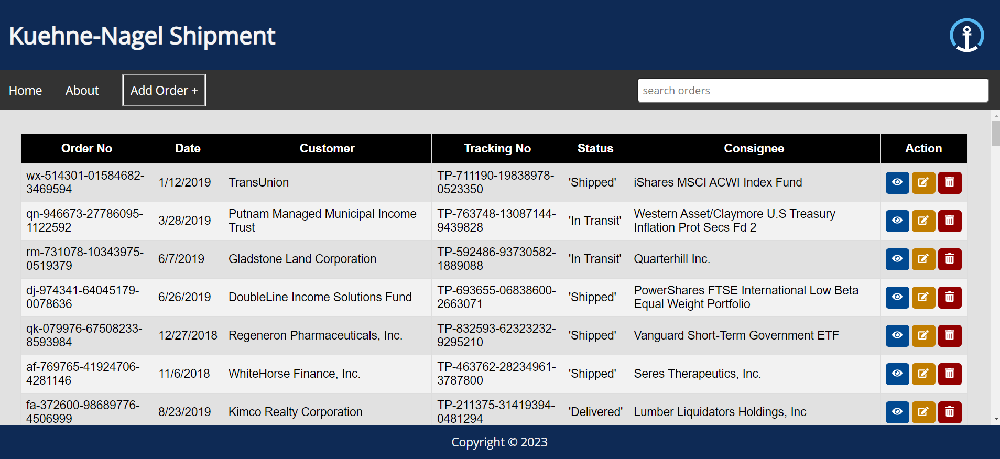
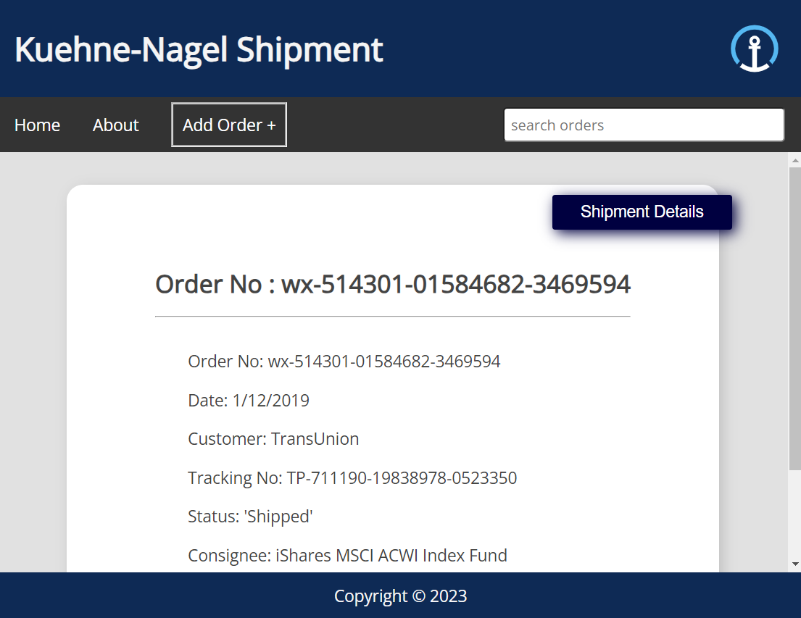
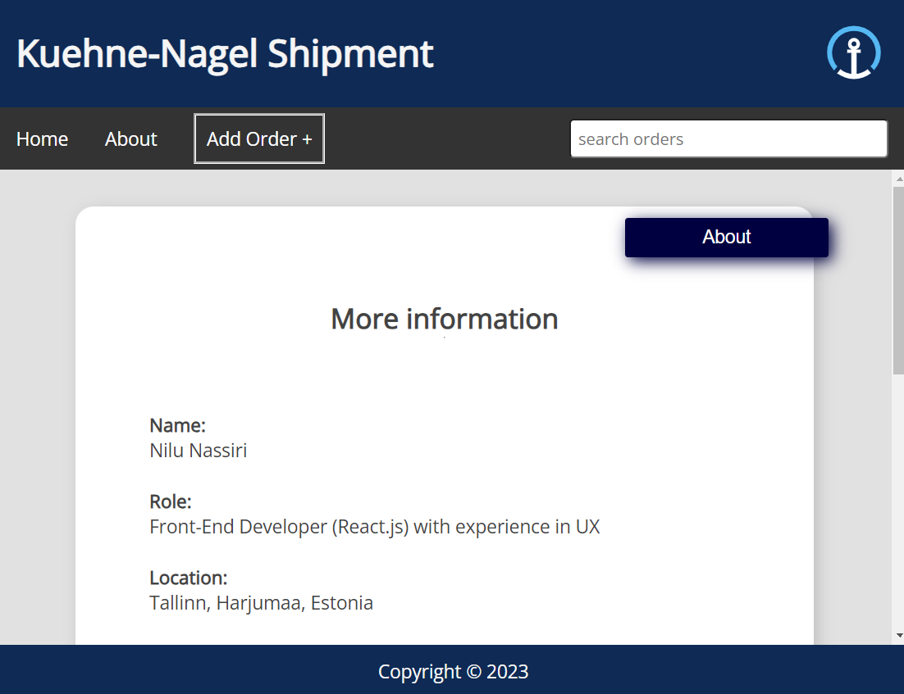
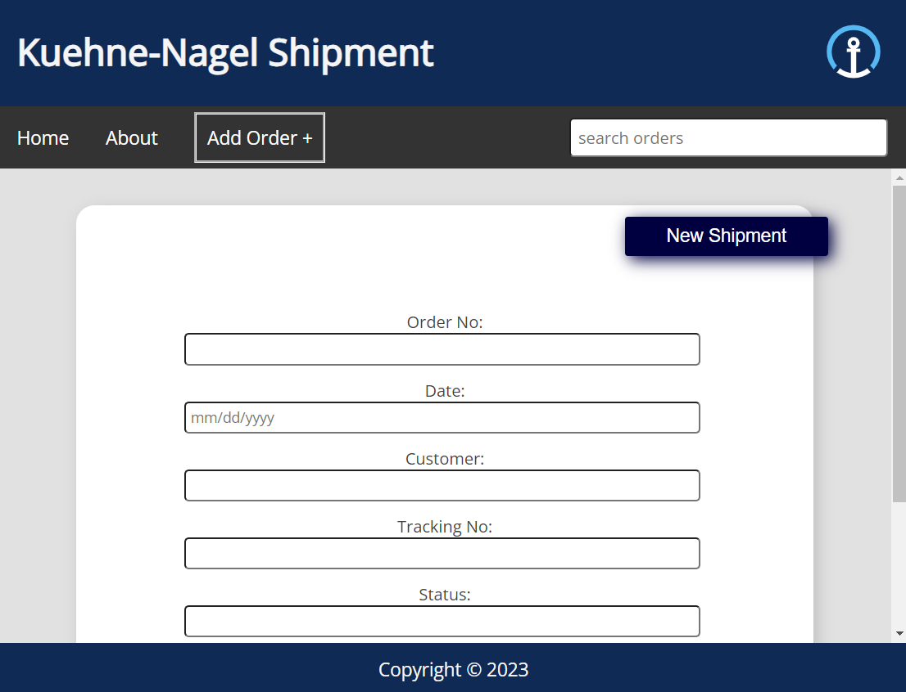
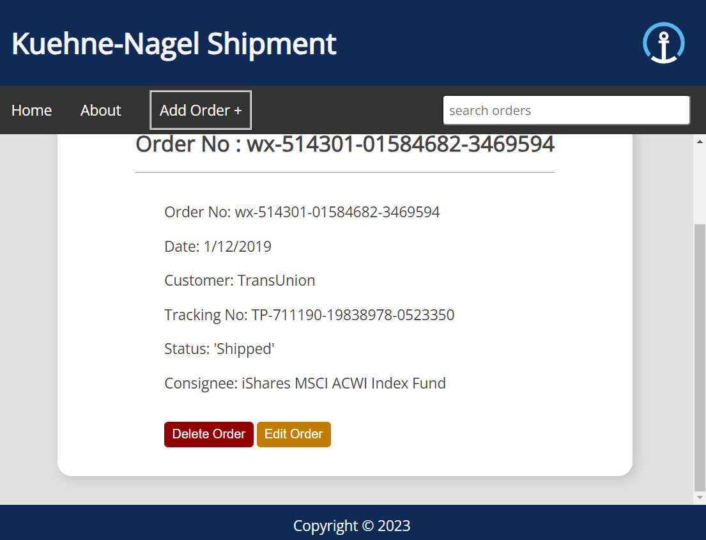

# Getting Started with Create React App

This project was bootstrapped with [Create React App](https://github.com/facebook/create-react-app).

## Run the Project:

In the project directory, you can run: `npm start`

Runs the app in the development mode.\
Open [http://localhost:3000](http://localhost:3000) to view it in your browser.

The page will reload when you make changes.\

### Used Packages and Libraries:

In this project I used react redux to read and fetch data from the api in store.js and import the Provider on index.js file . \

I used reducer to read data and edit and delete data in related pages. \

I used axios to fetch data from the api and make custom hooks using usestate and useEffect to use for fetch errors. \

to create the nav bar, I used Routes and Route from the react-router-dom.\

there is a dataContext in the app to make the app more clean and tidy using createContext from react. \

for the icons, I used react-icons library and used the Font Awsome package.\

### Api:

the api that is used is [https://my.api.mockaroo.com/shipments.json?key=5e0b62d0](https://my.api.mockaroo.com/shipments.json?key=5e0b62d0) from the task file. \

but I also made a json file as db.json. if the current api reached the limits and doesn't work, you can run a REST api using this command on terminal:

`npm json-server -p 3500 -w data/db.json`

then you can replace the current api with this url :

[http://localhost:3500/orders](http://localhost:3500/orders)

### Features:

IN this app, you can see a list of shipment details on Home page, using a table.\

In each row there are 3 options, you can choose view button to view the details in seprate page, edit button to edit data of a single item, and delete button to delete an item.\

On About page, there are some info about the Author, also you can find some contacts info.\

Using the "Add Order +" button, you can add new orders to the list.\

There are also 2 buttons on seprate item details page, where you can delete or update the item.\

You can also search items on the Homepage and find the one you are looking for.\